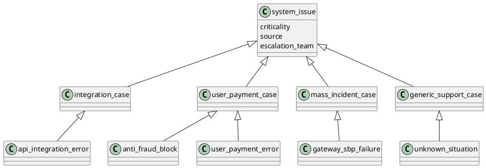

# Фреймовая база знаний

## Назначение

В проекте реализована фреймовая модель представления знаний для экспертной системы поддержки платежной платформы.  
Фреймы используются для описания диагностических кейсов, их общих характеристик, наследуемых свойств и уникальных признаков.

## Что реализовано

Реализация выполнена в `knowledge/base_facts.pl`.

Добавлены:

- базовый корневой фрейм `system_issue`
- фреймы второго уровня:
  - `integration_case`
  - `user_payment_case`
  - `mass_incident_case`
  - `generic_support_case`
- прикладные дочерние фреймы:
  - `api_integration_error`
  - `anti_fraud_block`
  - `user_payment_error`
  - `gateway_sbp_failure`
  - `unknown_situation`

## Структура фреймов

Базовый фрейм `system_issue` задает общие слоты предметной области:

- `criticality`
- `source`
- `escalation_team`
- `property(contact_channel)`
- `property(event_time)`

Фреймы второго уровня специализируют доменные группы:

- `integration_case` описывает интеграционные ошибки
- `user_payment_case` описывает пользовательские и эмитентские сценарии
- `mass_incident_case` описывает массовые инциденты
- `generic_support_case` описывает неопределенные ситуации

Прикладные кейсы оформлены как дочерние фреймы и получают часть слотов по наследованию.

## Наследование

Наследование реализовано через связку:

- `frame_parent/2`
- `frame_slot/3`
- `case_slot/3`
- `inherited_frame_slot/3`

Логика работы следующая:

- слот сначала ищется в текущем фрейме
- если слот не определен, поиск продолжается в родительском фрейме
- итоговое значение возвращается как унаследованное

Для свойств вида `property(...)` реализовано объединение по иерархии с поддержкой переопределения по ключу свойства.

## Переопределение слотов

В модели показано переопределение унаследованных значений:

- `anti_fraud_block` наследует `source` из `user_payment_case`, но переопределяет `criticality` в `high`
- `gateway_sbp_failure` наследует `source` и `escalation_team` из `mass_incident_case`, но задает собственное значение `criticality = high`
- `user_payment_error` наследует общие пользовательские признаки, но задает `criticality = low`
- `api_integration_error` переопределяет слот `property(http_status)` более точным описанием
- `anti_fraud_block` переопределяет слот `property(user_id)` более конкретной подсказкой

## Примеры данных по требованиям задания

### Наследуемые данные

Для дочерних объектов автоматически наследуются, например:

- `source`
- `escalation_team`
- `property(card_mask)`
- `property(sms_3ds_status)`

### Заданные собственные данные

Для конкретных фреймов явно заданы, например:

- `title`
- `explanation`
- `recommended_action`
- `criticality`
- уникальные `property(...)`

Таким образом требование "2 и более заданных и 2 и более наследуемых данных" выполнено.

## Использование в экспертной системе

Фреймовая база знаний интегрирована в основной модуль `payment_support_expert_system.pl`.

Использование выполняется через:

- `case_info/4` — получение итоговых описательных слотов кейса
- `case_property/3` — получение полного списка признаков с учетом наследования
- `show_diagnosis/2` — вывод ключевых фреймовых слотов в результате диагностики

Во время работы системы выводятся:

- название кейса
- описание
- рекомендуемое действие
- критичность
- источник сигнала
- команда эскалации
- характерные признаки

## Упрощенная диаграмма сети фреймов

## Итог

В проекте сформирована фреймовая база данных с двухуровневой иерархией объектов.  
Модель поддерживает:

- хранение знаний в виде фреймов и слотов
- наследование общих характеристик
- переопределение унаследованных значений
- добавление уникальных признаков дочерним объектам
- использование фреймов в пользовательском сценарии экспертной системы
